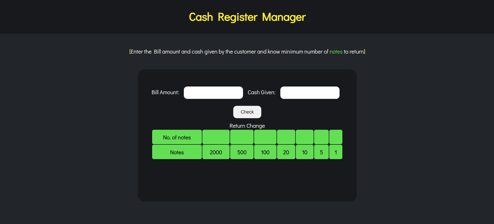
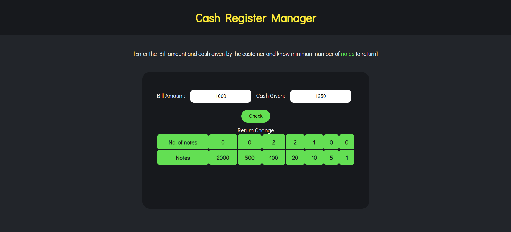
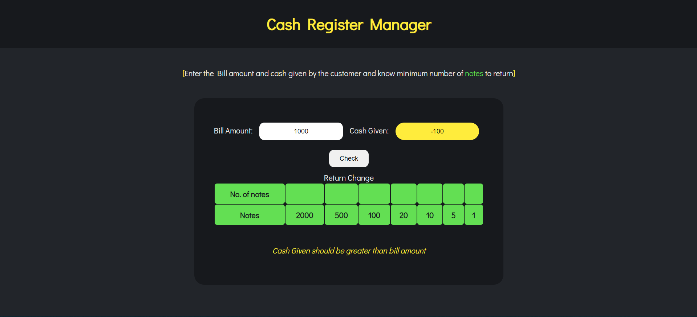
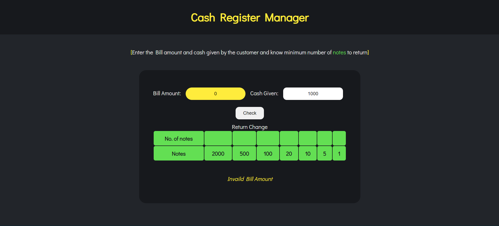

# Cash Register Manager
Cash Register for providing number of notes to return.

>Colored outputs are being shared based on different input scenarios

Here are a few project-related insight pictures:

1. Landing Page 

2. Case1: Cash given > Bill Amount- Entering the input details and checking the number of notes to be returned

3. Case2: Handling negative cash given

4. Case3: Validating bill amount should also be greater than 0

> Technologies/Libraries used :-
* Vanilla Javascript
* CSS
* HTML

> Platform used to develop project :-
* [Visual Studio Code](https://code.visualstudio.com/)
> Platform used to host and deploy the project :-
* [Github.com](https://github.com/ionbain)
* [Netlify.com](https://app.netlify.com/teams/bhaskartx/)

